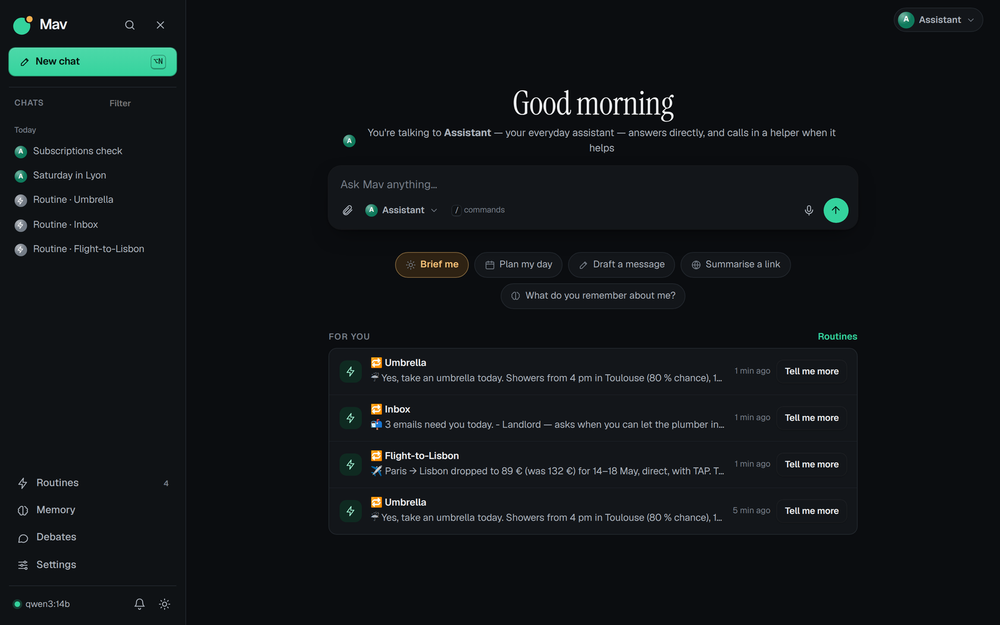
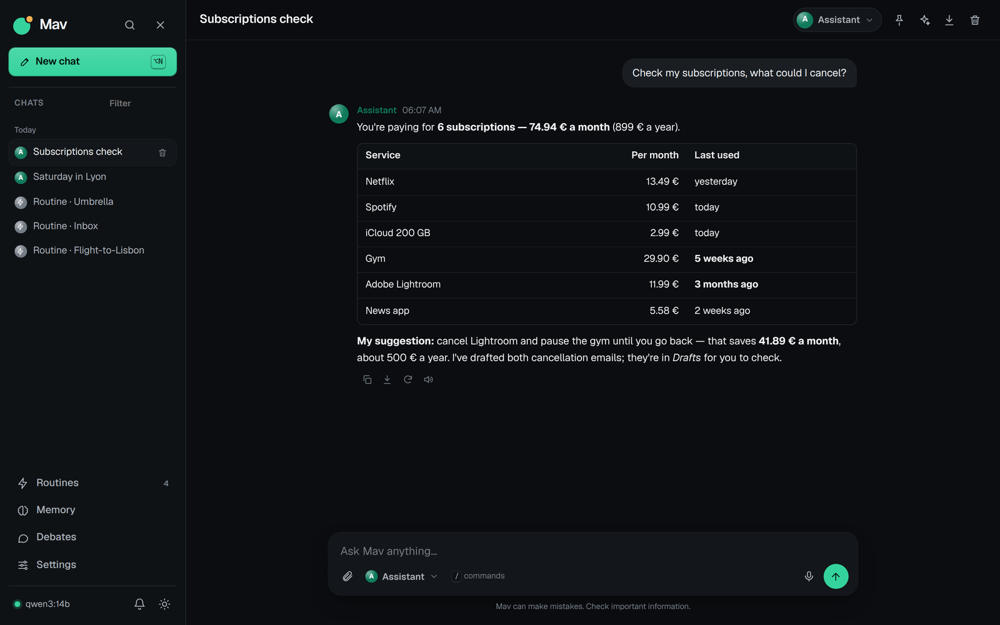
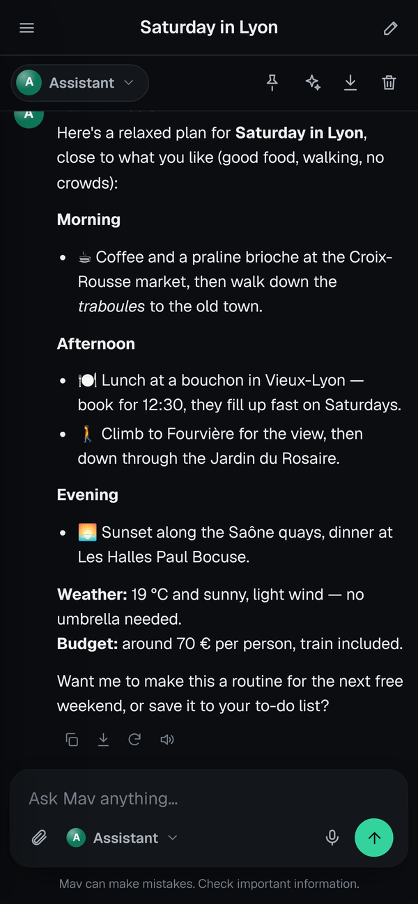
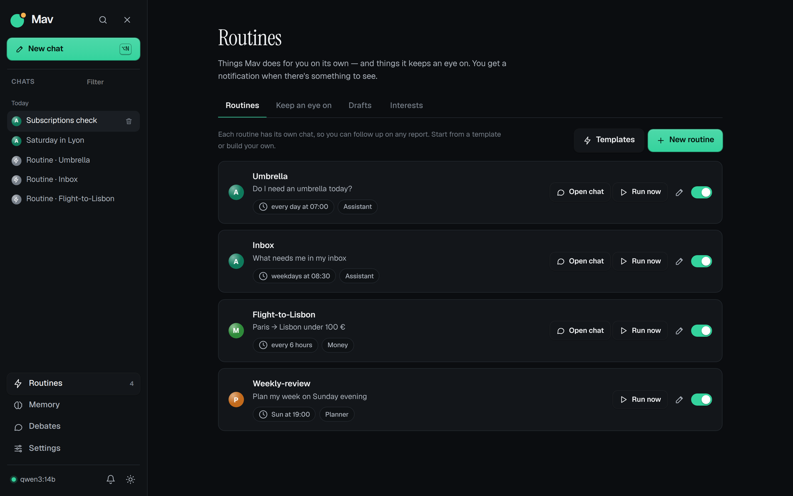
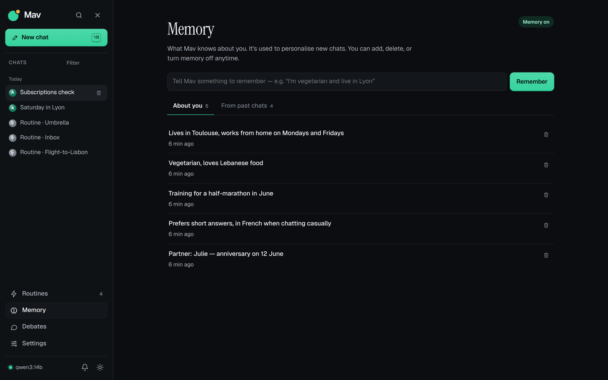

<div align="center">

<picture>
  <source media="(prefers-color-scheme: dark)" srcset="docs/assets/logo-dark.svg" />
  
</picture>

**Your everyday AI assistant — proactive, private, on your own machine, with your own model.**

Chat like ChatGPT. Then let it work for you: routines that run on their own,
pages and prices it keeps an eye on, and a memory of what matters to you.

[](https://github.com/SoaOaoS/mav/actions/workflows/ci.yml)
[](https://github.com/SoaOaoS/mav/releases/latest)
[](LICENSE)
[](https://soaoaos.github.io/mav/)
[](https://github.com/SoaOaoS/mav/actions/workflows/codeql.yml)
[](https://securityscorecards.dev/viewer/?uri=github.com/SoaOaoS/mav)
[](SECURITY.md)

`curl -fsSL https://raw.githubusercontent.com/SoaOaoS/mav/main/get.sh | sudo bash`

**Website & docs:** <https://soaoaos.github.io/mav/> ·
[documentation](https://soaoaos.github.io/mav/docs.html)

</div>

<p align="center">
  
</p>

## What it does

- **Chat** — a clean, ChatGPT-style web app (installable on your phone).
  Chats are titled automatically and grouped by day; type `/` for commands.
- **Helpers** — you talk to the **Assistant** by default. It calls in the
  **Researcher** (web, facts, comparisons), **Writer** (messages, emails),
  **Planner** (days, trips, to-dos) or **Money** (budgets, purchases) when
  useful — or you pick one yourself. You always see who is answering.
- **Memory** — Mav learns facts about you and recalls them, and relevant past
  chats, in new conversations. See, add and delete everything on the Memory
  page, or type `/remember …` in a chat. Stored in Postgres on your machine.
- **Routines** — "every morning at 7, tell me if I need an umbrella". Create
  them from a simple form, a ready-made template, with `/routine`, or just say
  it in a chat and confirm (English, French or Spanish). Schedules can be
  daily, weekly, monthly (a day, or the last day of the month), every few
  hours, or triggered by an incoming event (a webhook). A routine can also be
  conditional — "only if it's going to rain". Each routine has its own chat
  you can open and follow up in, and you get a push when it has something for
  you.
- **Proactivity** — Mav ranks what it finds (critical, important, useful,
  fyi) so more proactivity never means more noise. Set how far it can go:
  _Quiet_ only interrupts for what's critical, _Chatty_ also sends the small
  stuff; anything below your level is collected into one daily recap.
- **Drafts & background actions** — when Mav spots a mail to answer or a
  follow-up to send, it prepares a draft for you to review. Ask for something
  long and it runs in the background, then comes back with the result.
- **Keep an eye on** — a web page, a product price (optionally only below a
  target), or a news topic. Alerts only when something actually changes.
- **Daily briefing** — every morning (Settings → General, your time), one
  short message: the weather where you live, what happened since yesterday
  (alerts, routine reports), what needs you (drafts to approve), something
  from your interests. Or anytime: *Brief me* on the new-chat screen, `/brief`.
- **For you** — the new-chat screen shows your latest routine reports and
  alerts, each with _Tell me more_.
- **Your model** — Anthropic, OpenAI, Ollama (local or cloud), OpenRouter or
  any OpenAI-compatible API. Switch anytime from Settings → Model: no terminal.
- **Connections** — plug in other apps and services from Settings →
  Connections: pick one from the catalog (read web pages, web browser, Brave
  search, time zones, your files, Notion, Home Assistant, GitHub) and fill in
  its key, or add any MCP server yourself.
- **Know what it costs** — Settings → Usage shows this month's spend, tokens
  and a 30-day chart, split between chats, routines and background work. Set a
  monthly budget (warn at 80 % / 100 %, or stop), and pick a cheap model for
  background work (titles, memory, summaries).
- **Always up to date** — a button tells you when a new version is out and
  installs it for you; changes that need a restart show a _Restart assistant_
  bar until you apply them.

## Screenshots

<table>
  <tr>
    <td width="66%"></td>
    <td rowspan="2" align="center"></td>
  </tr>
  <tr>
    <td></td>
  </tr>
  <tr>
    <td colspan="2"></td>
  </tr>
</table>

<sub>Chat · Mav on a phone · Routines · Memory. Shown with sample data.</sub>

## Install

On a Linux machine with systemd — Debian, Ubuntu, Arch (Omarchy, Manjaro…)
or Fedora — a home server, a mini PC, a VPS:

```bash
curl -fsSL https://raw.githubusercontent.com/SoaOaoS/mav/main/get.sh | sudo bash
```

or

```bash
git clone https://github.com/SoaOaoS/mav.git && cd mav && sudo ./install.sh
```

The setup asks only what it must:

1. **Your model provider** (arrow keys), your **API key** — checked live — and
   the **model**, picked from the provider's own list. Or _set it up later_ in
   the dashboard.
2. Optionally, a **contact email** for push notifications.

Everything else gets sensible defaults (an _Advanced settings?_ prompt lets
you change the user, ports and quiet hours). Then it installs and starts
everything; details go to `/var/log/mav-install.log`. Open the address it
prints, and say hello.

## Manage it

```bash
mav status        # what's running, the address, the model
mav doctor        # check everything, with a hint for each problem
mav update        # install the latest release, keep your settings
                  #   --check · --local (no download) · --channel main · --force
mav version       # installed and latest version
mav restart [engine|worker|web]
mav logs [engine|worker|web|install] [-n 50]
mav backup        # memory, routines and settings → /var/backups/mav/
mav password      # set or reset the password of the web app
mav reconfigure   # change the model, or re-run the setup
mav uninstall     # remove the services (your data is kept)
```

Updates can also be installed from the web app (sidebar → _Update to vX.Y.Z_).

Unattended install: `sudo ./install.sh --yes` with `MAV_PROVIDER`
(`anthropic`, `openai`, `ollama`, `ollama-cloud-api`, `openrouter`),
`MAV_PROVIDER_APIKEY`, `MAV_OPENCODE_MODEL`, and optionally
`MAV_PROVIDER_BASEURL`, `MAV_VAPID_EMAIL`. `--dry-run` shows what would happen.

## How it works

```
   Browser / phone (PWA)
          │
          ▼
   ┌──────────────────┐      ┌──────────────────────┐
   │  mav-dashboard   │ ───► │  mav-server          │
   │  web app + API   │      │  opencode agent      │
   └──────────────────┘      │  engine (:4096)      │
          │                  └──────────────────────┘
          │                            ▲
          ▼                            │
   ┌──────────────────┐      ┌──────────────────────┐
   │  Postgres        │ ◄─── │  mav-worker          │
   │  memory, alerts  │      │  routines, watching, │
   └──────────────────┘      │  push notifications  │
                             └──────────────────────┘
```

| Service         | Role                                                    |
| --------------- | ------------------------------------------------------- |
| `mav-dashboard` | the web app and its API                                 |
| `mav-server`    | the agent engine ([opencode](https://opencode.ai))      |
| `mav-worker`    | runs routines and "keep an eye on", sends notifications |

The web app is protected by a password you choose on your first visit.
Everything runs on your machine. The only thing that leaves it is what you send
to the model provider you chose — or nothing at all with a local Ollama.

## Security

Static analysis (**CodeQL**) and a supply-chain posture check
(**OpenSSF Scorecard**) run on every push to `main`; secret scanning and push
protection are enabled. To report a vulnerability privately, see
[SECURITY.md](SECURITY.md).

## Upgrading from the Telegram version

Telegram support was removed: Mav is now a web app (installable on your phone)
with push notifications. Older versions of `mav update` only reinstalled the
local copy, so run the one-line installer once
(`curl -fsSL https://raw.githubusercontent.com/SoaOaoS/mav/main/get.sh | sudo bash`)
and choose **Update**; from then on `mav update` downloads new versions by
itself. The update migrates for you — it replaces the
`mav-bot` service with `mav-worker`, keeps your memory (it now lives in
Postgres; the old `memory.json` is imported automatically), your routines, your
model and your settings. Helper files you already had in
`~/.config/opencode/agent/` are left untouched; the new everyday helpers are
added next to them.

## Versions

Every push to `main` is tagged with a [semantic version](https://semver.org)
and published as a GitHub release (`.github/workflows/release.yml`). The bump
comes from the commit messages, written as
[Conventional Commits](https://www.conventionalcommits.org):

| Commit                                             | Release                     |
| -------------------------------------------------- | --------------------------- |
| `feat!: …` or a `BREAKING CHANGE:` footer          | major — `v1.4.2` → `v2.0.0` |
| `feat: …`                                          | minor — `v1.4.2` → `v1.5.0` |
| anything else (`fix:`, `docs:`, `chore:`, merges…) | patch — `v1.4.2` → `v1.4.3` |

`get.sh`, `mav update` and the update button install the latest release. CI
(`.github/workflows/ci.yml`) runs shellcheck, syntax checks and the tests in
`tests/` on every pull request.

## Repository

```
mav/
├── get.sh              # "curl | bash" bootstrap
├── install.sh          # the setup wizard
├── agents/             # the everyday helpers (Assistant, Researcher, …)
├── bot/                # mav-worker: routines, watching, memory, notifications
├── dashboard/          # the web app (front-end + server/)
├── scripts/mav         # the mav command
├── scripts/            # database schema, version helper
├── tests/              # unit and script tests (run by CI)
├── systemd/            # service templates
└── docs/               # website, docs, roadmap (PLAN.md), brand (BRAND.md), screenshots
```

Hacking on the web app without a model: run
`python3 dashboard/tools/fake_engine.py` and point the dashboard at it with
`OPENCODE_URL=http://127.0.0.1:4096` (see [dashboard/README.md](dashboard/README.md)).

## License

MIT — see [LICENSE](LICENSE).
